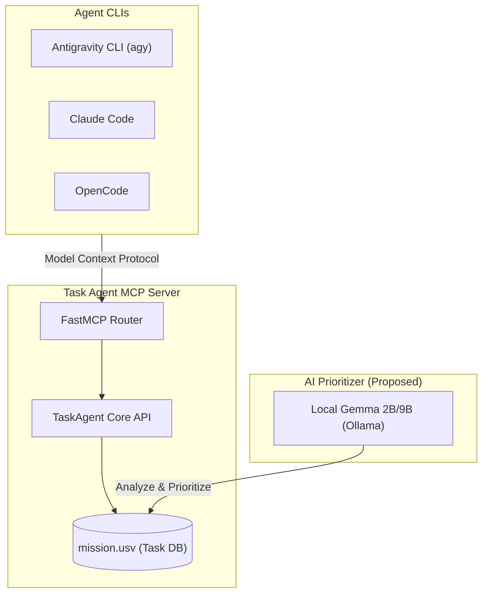

# Investigation: Enhancing Task Agent Integration with Agent CLIs

This report investigates improvements to the integration between **Task Agent** (`ta`) and developer agent CLIs such as **Antigravity CLI** (`agy`), **Claude Code** (`claude`), and **OpenCode** (`opencode`).

---

## 1. Overview of the Integration Architecture

Task Agent acts as a structured, prioritized task database (`mission.usv`). Developer CLIs interface with it using the **Model Context Protocol (MCP)**, granting LLMs tool-level access to query, update, and complete tasks.



---

## 2. Key Areas for Improvement & Proposals

### 💡 Proposal A: Shell Prompt Integration (`ta-prompt`)
Currently, developers must manually run `ta active` or `ta list` to see what task is active.
*   **Concept**: Implement a shell integration (similar to git prompt builders like Starship) that displays the currently active task slug and priority directly in the terminal prompt.
*   **Implementation**: Add a lightweight command:
    ```bash
    ta prompt
    # Outputs: [ta:create-agy-cli (p1)]
    ```
    This can be sourced in `.bashrc` / `.zshrc` to keep the active task always visible to the developer.

### 🔌 Proposal B: Auto-configure Antigravity CLI (`agy`)
We already support auto-registering the task-agent MCP server with `claude` and `opencode` via `ta init-mcp`.
*   **Concept**: Add support for registering with `agy`.
*   **Implementation**: Extend `ta init-mcp` to support the `--agy` flag, which adds the task-agent MCP server configuration to `~/.gemini/antigravity-cli/mcp_config.json` automatically:
    ```bash
    ta init-mcp --agy
    ```

### 🧠 Proposal C: Local Gemma-based Task Prioritization
Instead of manual priority adjustments, we can utilize a small, locally-running LLM (like Gemma 2B or 9B via Ollama) to prioritize the queue.
*   **Concept**: Run a local Gemma model to analyze the dependencies, description complexity, and codebase context to auto-sort tasks.
*   **Implementation Flow**:
    1. Read all tasks from `mission.usv` (including titles, descriptions, and criteria).
    2. Extract file references and recent commit histories to build context.
    3. Call the local Gemma model (via `http://localhost:11434/api/generate`) with a structured prompt asking it to order the tasks by dependency and logical progression.
    4. Write back the optimized ordering to `mission.usv`.

### 🤝 Proposal D: Inter-Agent Protocol (IAP) Coordination
For workspaces where multiple agents are running in parallel:
*   **Concept**: Establish a protocol where agents notify each other about task state transitions.
*   **Implementation**: Task Agent can write state transitions to a shared workspace channel (or lightweight SQLite lockfile) so that concurrent agents do not pick up the same active tasks or attempt conflicting merges.

---

## 3. Recommended Next Steps

> [!IMPORTANT]
> 1. **Extend `ta init-mcp`**: Implement the `agy` target to facilitate zero-configuration MCP setups.
> 2. **Build `ta prompt`**: Create a fast, sub-millisecond command suitable for shell prompts to display the active task.
> 3. **Draft Gemma script**: Write a prototype Python script under `scripts/prioritize_gemma.py` that interfaces with Ollama to sort USV tasks.
